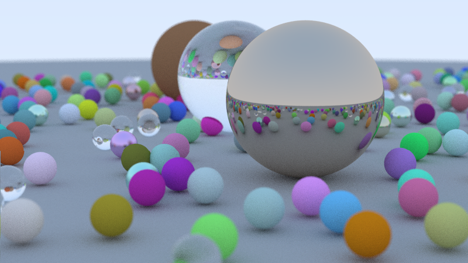

# Raytracing

## Description
[Raytracing in one weekend book](https://raytracing.github.io/books/RayTracingInOneWeekend.html) done using idiomatic Rust. 
Changes from original C++ code include:
- Newtype pattern for strong typization of Vec3, Point3 and Color structs wich all have same memory layout but different interfaces. Same for Degrees and Radians structs.
- Dynamic polymorphism using traits system.
- Heavily refactored code using Rust`s standart library. Especially iterators.
## Usage
```
cargo run --release > image.ppm
```